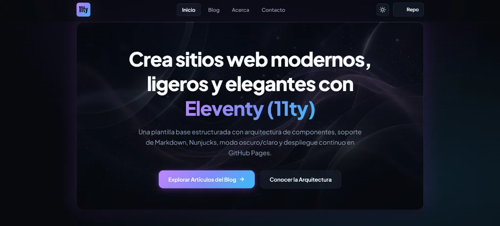

# 🦡 Starter Project Eleventy (11ty)

<p align="center">
  
</p>

<p align="center">
  <a href="https://frankusqabant.github.io/starter-project-eleventy/">
    
  </a>
  
  
  
  
</p>

<p align="center">
  🌐 <b>Sitio Web Desplegado:</b> <a href="https://frankusqabant.github.io/starter-project-eleventy/">https://frankusqabant.github.io/starter-project-eleventy/</a>
</p>

---

## ⚡ ¿Qué es este proyecto?

Una plantilla base moderna, ultraligera y lista para producción, creada con **Eleventy (11ty)** y **Nunjucks**. Diseñada para ofrecer la máxima puntuación de rendimiento (100/100 en Lighthouse), estética cinematográfica y cero sobrecarga de JavaScript innecesario.

---

## ✨ Características Principales

- 🚀 **Ultrarrápido & Ligero:** Salida 100% estática optimizada con imágenes en formato WebP (~30-80 KB).
- 🌓 **Modo Oscuro / Claro:** Alternador accesible con persistencia en `localStorage`.
- 🔍 **Blog con Búsqueda en Vivo:** Filtrado en tiempo real por texto y categorías (*Libros*, *Películas*).
- 📖 **Barra de Lectura:** Indicador dinámico de avance en artículos Markdown.
- 🎨 **Diseño Moderno:** Efectos *glassmorphism*, iluminación iridiscente y tipografía *Plus Jakarta Sans*.

---

## 🚀 Inicio Rápido (Desarrollo)

```bash
# 1. Clonar e ingresar
git clone https://github.com/FrankUsqAbant/starter-project-eleventy.git
cd starter-project-eleventy

# 2. Instalar dependencias
npm install

# 3. Iniciar servidor de desarrollo
npm run start
```

---

## 🛠️ Comandos Principales

| Comando | Descripción |
| :--- | :--- |
| `npm run start` | Inicia el entorno local con recarga en vivo. |
| `npm run deploy` | Compila los archivos estáticos en la carpeta `docs/`. |
| `npm run clean` | Limpia los archivos compilados en `docs/`. |

---

## 📁 Estructura del Proyecto

```text
├── code/
│   ├── _includes/    # Componentes modulares (header, menu, footer, layouts)
│   ├── css/          # Estilos modernos con variables y temas (styles.css)
│   ├── js/           # Interactividad ligera y buscador (main.js)
│   ├── img/          # Imágenes optimizadas en WebP
│   └── *.njk / *.md  # Páginas y publicaciones en Markdown
├── docs/             # Salida estática compilada para GitHub Pages
└── .eleventy.js      # Configuración de 11ty
```

---

## 📄 Licencia

Distribuido bajo la licencia [MIT](LICENSE).
